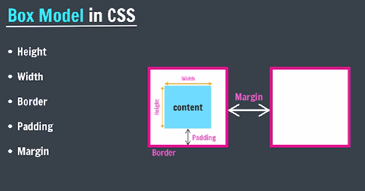
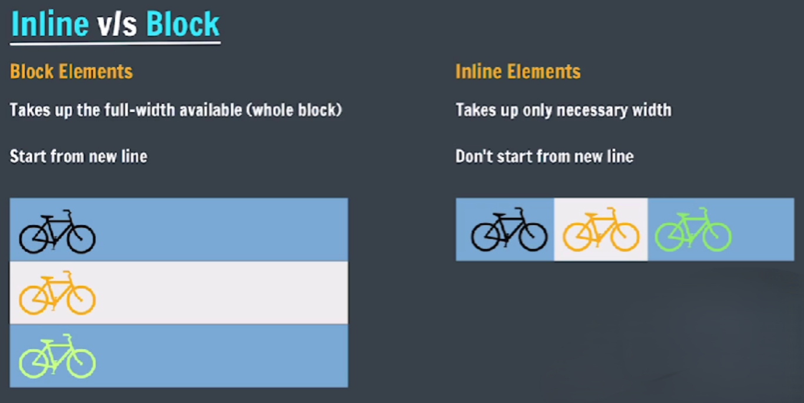

## CSS Box Model
The **CSS Box Model** describes the rectangular boxes generated for elements in the document tree. Every HTML element is essentially a box with four areas: **content**, **padding**, **border**, and **margin**. Understanding this model is essential to control spacing, sizing, and layout of elements in your webpage.

**Box Model Structure**



- **Height** <br>
    By default, it sets the content area height of the element.

    ```css
    div {
        height: 100px;
    }
    ```

    - Content area grows vertically based on this value.
    - If content overflows, you may need to use `overflow` property.

- **Width** <br>
    By default, it sets the content area width of the element.

    ```css
    div {
        width: 800px;
    }
    ```

    - Similar to height, this sets only the content box width.
    - Use `max-width` or `min-width` to control responsiveness.

- **Border** <br>
    Used to set an element's border.

    - **Components**:
        - `border-width`: thickness of the border
        - `border-style`: style such as `solid`, `dashed`, `dotted`, etc.
        - `border-color`: sets the border's color

    - **Shorthand Syntax** <br>
        width | style | color

        ```css
        div {
            border: 2px solid blue;
        }
        ```

        Format: `border: [width] [style] [color];`

    - **Border Sides** <br>
        To control an individual side of the box.

        ```css
        border-left
        border-right
        border-top
        border-bottom
        ```

    - **Border Radius** <br>
        Rounds the corners of the box:

        ```css
        div {
            border-radius: 20px;
        }

        div {
            border-radius: 50%; /* Perfect circle for square elements */
        }

        div {
            border-top-right-radius: 10px;
        }
        ```

        [MDN Border Radius Docs](https://developer.mozilla.org/en-US/docs/Web/CSS/border-radius)

- **Padding** <br>
    Padding is the space between the content and the border. It pushes the border outward.

    ```css
    div {
        padding: 50px;
    }

    div {
        padding-left: 50px;
    }
    ```

    - **Padding Sides**

        ```css
        padding-left
        padding-right
        padding-top
        padding-bottom
        ```

    - **Padding Shorthand**

        1. For all 4 sides:
        ```css
        padding: 10px;
        ```
        2. top & bottom | left & right:
        ```css
        padding: 10px 20px;
        ```
        3. top | left & right | bottom:
        ```css
        padding: 10px 20px 30px;
        ```
        4. top | right | bottom | left:
        `clock wise` 
        ```css
        padding: 10px 20px 30px 40px;
        ```

- **Margin** <br>
    To set spacing on the outside of border.

    ```css
    div {
        margin: 50px;
    }

    div {
        margin-left: 50px;
    }
    ```

    - **Margin Sides**

        ```css
        margin-left
        margin-right
        margin-top
        margin-bottom
        ```

    - **Margin Shorthand** <br>
        Same structure as padding:

        1. All sides:
        ```css
        margin: 10px;
        ```
        2. Top & Bottom | Left & Right:
        ```css
        margin: 10px 20px;
        ```
        3. Top | Left & Right | Bottom:
        ```css
        margin: 10px 20px 30px;
        ```
        4. Top | Right | Bottom | Left:
        ```css
        margin: 10px 20px 30px 40px;
        ```

## Display
It sets whether an element is treated as a block or inline element and the layout used for its children.

```css
display: block;       /* Takes full width, starts on a new line */
display: inline;      /* Fits in line with text */
display: inline-block;/* Behaves like inline, but allows width & height */
display: none;        /* Hides the element entirely */
```

[MDN Display Docs](https://developer.mozilla.org/en-US/docs/Web/CSS/display)

## Inline Vs Block



## Units in CSS

- **Absolute Units**

    | Unit | Description     |
    |------|-----------------|
    | px   | Pixels          |
    | pt   | Points          |
    | pc   | Picas           |
    | cm   | Centimeters     |
    | mm   | Millimeters     |
    | in   | Inches          |

- **Relative Units**

    | Unit | Description                               |
    |------|-------------------------------------------|
    | %    | Relative to parent element                |
    | em   | Relative to parent font size              |
    | rem  | Relative to root (html) font size         |
    | ch   | Relative to width of the "0" character    |
    | vh   | Relative to 1% of the viewport height     |
    | vw   | Relative to 1% of the viewport width      |

    - **Percentages (`%`)**
    
        It is often used to define a size as relative to an element's parent object.

        ```css
        div {
            width: 50%;         /* 50% of parent's width */
            margin-left: 10%;   /* 10% of parent's width */
        }
        ```

    - **`em` (Relative to parent font size)**
    
        em: Font size of the parent, in the case of typographical properties like `font-size`, and font size of the element itself, in the case of other properties like `width`.

        Used to size elements based on the font size of their **immediate parent**.

        ```css
        /* If parent font-size is 20px */
        .parent {
            font-size: 20px;
        }
        
        .child {
            font-size: 2em; /* 2 * 20px = 40px */
        }
        ```

        - **Drawback of Em**: Snowball effect in nested elements 

    - `rem` (Relative to root `<html>` font size)
    
        rem: Font size of the root element.
        
        Used to size elements based on the **root element’s** (`<html>`) font size - more predictable and consistent for scalable designs.
        
        ```css
        html {
            font-size: 16px;
        }
        
        div {
            font-size: 2rem; /* 2 * 16px = 32px */
        }
        ```

**Further Reading**: [CSS Box Model - MDN](https://developer.mozilla.org/en-US/docs/Web/CSS/CSS_box_model/Introduction_to_the_CSS_box_model)
