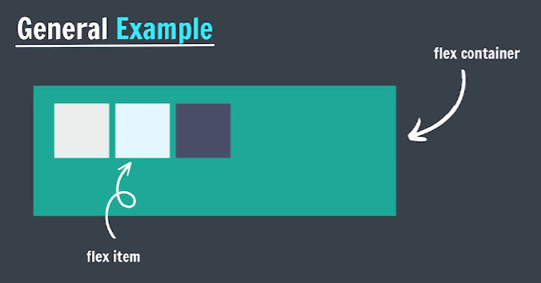

# Flex Box

Flexible Box Layout

It is a one-dimensional layout method for arranging items in rows or columns.

[Flexbox Cheat sheet](flowbox-summary.pdf)

In a flex layout, you apply the display property with a value of flex or inline-flex to an element to define it as a flex container. This enables a flex context for all its direct children, known as flex items.

```css
container {
 display: flex; /* or inline-flex */
}
```



## flex-direction

It sets flex items are placed in the flex container, along which axis and direction.

```css
flexbox-direction: row; /* main axis, left to right */

flexbox-direction: row-reverse; /* main axis, right to leftt */

flexbox-direction: column; /* main axis, top to bottom */

flexbox-direction: column-reverse; /* main axis, bottom to top */

```

## justify-content

Tells the browser distributed space between and around content items along the main axis.

```css
justify-content: flext-start;

justify-content: flext-end;

justify-content: center;

justify-content: space-between;

justify-content: space-around;

justify-content: space-evenly;
```

## flex-wrap

Sets whether flex items are forced onto one line or can wrap onto multiple lines.

```css
flex-wrap: nowrap;

flex-wrap: wrap;

flex-wrap: wrap-reverse;
```

## align-items

Distributes our items along the cross axis.

```css
align-items: flext-start;

align-items: flext-end;

align-items: center;

align-items: baseline;
```

## align-content

It sets the distribution of space between and around content items along a flexbox's cross axis.

```css
align-content: flex-start/flex-end/center;

align-content: space-between/space-around/evenly;

align-content: baseline;
```

## align-self

Align an item along the cross axis.

```css
align-self: flex-start;

align-self: flex-end;

align-self: center;

align-self: baseline;
```

## Flex Sizing

### flex-basis

It sets the initial main size of a flex item.

```css
flex-basis: 100px;
```

### flex-grow

It specifies how much of the flex container's remaining space should be assigned to the flex item's main size

```css
flex-grow: 1;
```

### flex-shrink

It sets the flex shrink factor of a flex item.

```css
flex-shrink: 1;
```

### Shorthand Syntax

- flex-grow | flex-shrink | flex-basis

    ```css
    flex: 2 2 100px;
    ```

- flex-grow | flex-basis

    ```css
    flex: 2 100px;
    ```

- flex-grow (unitless)

    ```css
    flex: 2;
    ```

- flex-basis

    ```css
    flex: 100px;
    ```