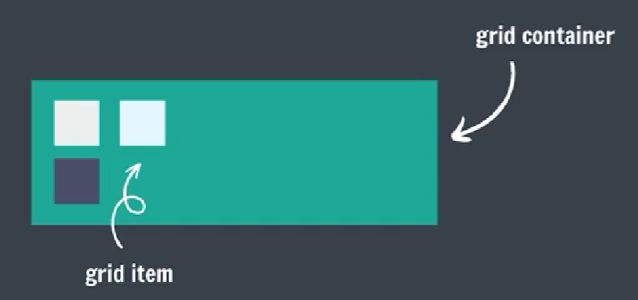
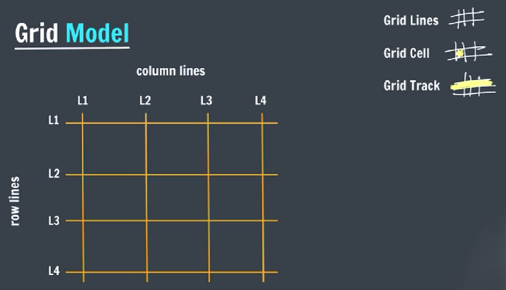

## CSS Grid

Setting a container's display to grid will make all children grid items.

```css
container{
    display: grid;

    display: inline-grid;
}
```
**General Example:** <br> 



### Grid Template

They define the lines & track sizing.

```css
grid-template-rows: 50px 50px 50px;

grid-template-columns: 100px 100px 100px;
```

- **Grid Template (repeat)**

    Repeat is used to divide all available space.
    
    ```css
    grid-template-rows: repeat(count, 1fr);
    
    grid-template-columns: repeat(count, 1fr);


    grid-template-rows: repeat(3, 1fr);
    
    grid-template-rows: 1fr, 1fr, 1fr;
    ```

### Grid Gaps

They define the gaps between the lines.

```css
row-gap: 10px;

column-gap: 20px;

grid-gap: rowGap columnGap;
```

### Grid Columns

Definess an item's starting & ending position inside the column.

```css
grid-column-start: line_number;

grid-column-end: line_number;


grid-column: start_col/end_col;

grid-column: start_col/span number;
```

### Grid Rows

Defines an item's starting & ending position inside the row.

```css
grid-row-start: line_number;

grid-row-end: line_number;


grid-row: start_row/end_row;

grid-row: start_row/span number;
```

### Grid Properties

```css
justify-items /* container | horizontal */

justify-self /* item | horizontal */

align-items /* container | vertical */

align-self /* item | vertical */

place-items /* container | horizontal & vertical */

place-self /* item | horizontal & vertical */
```

## CSS Animations

To animate CSS elements.

```css
@keyframe myName{
    from {font-size:20px;}
    to {font-size: 40px;}
}
```

```css
animation-name

animation-duration

animation-timing-function

animation-delay

animation-iteration-count

animation-direction: normal / reverse / alternate / alternate-re;
```

### Animation Shorthand

```css
animation: name duration timing-function delay iteration-count direction fill-mode;

animation: myName 2s linear 3s infinite normal;
```

### % in Animation

```css
@keyframes myName{
    0%{font-size: 20px;}
    50%{font-size: 30px;}
    100%{font-size: 40px;}
}
```

## Media Queries

Help create a responsive website.

### Media Features - Width (of viewport)

```css
@media(max-width: 400px){
    div{
        background-color: red;
    }
}
```

### Orientation (of viewport)

```css
@media(orientation: landscape){
    div{
        background-color: red;
    }
}
```

## z-index

It decides the stack level of elements.

Overlapping elements with a larger z-index cover those with smaller one.

```css
z-index: auto (0)

z-index: 1/2/...

z-index: -1/-2/...
```

z-index works only on positioned elements (relative, absolute, fixed, sticky).
