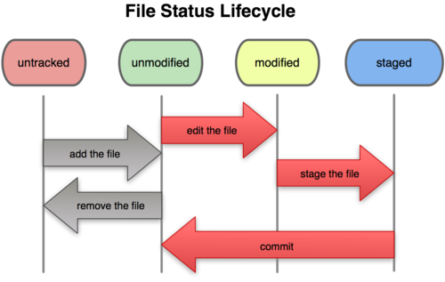

# Git & GitHub

For a quick reference, check out this [Git Cheat Sheet](https://git-scm.com/cheat-sheet).

## What is Git?

Git is a Free & Open Source **Version Control System** - a tool that help to track changes in code.

- Track history
- Help to collaborate

To get started with Git, [download Git here](https://git-scm.com).

## What is GitHub?

GitHub is a web-based platform where we hosts Git repositories online.

[Create a GitHub Account](https://github.com)

## Using Git

You can interact with Git using several methods:

- Command Line (Most Popular)
- IDE/Code Editor (like VS Code)
- Graphical User Interface (like GitKraken)

## Configuring Git

Before using Git, configure your Git user:

```bash
# Set your Git username
git config --global user.name "Your Name"

# Set your Git email (must match the email used in your GitHub account)
git config --global user.email "youremail@example.com"
```

## Basic Git Commands

### clone

Cloning a repository on our local machine.

```bash
git clone RepositoryLink
```

### status

Display the state of the code.

```bash
git status
```



### log

Used to view the history of commits in your git repository.

```bash
git log
```

### add

Adds new or changed files in your working directory to the git staging area.

```bash
git add fileName
```

```bash
git add .
# Stages all changes in the current directory (new, modified, deleted files) so they’re ready to be committed.
```

### commit

It is the record of change.

```bash
git commit -m "some message"
```

### push

Upload local repo content to remote repository.

```bash
git push origin main
```

### init

Used to create a new Git repository.

```bash
git init
```

It initializes a hidden `.git` folder in your project directory, which stores all the metadata and version history, allowing you to start tracking changes with Git.

## Pushing Local Repo

### Initialize Git (if not already done)

```bash
git init
```

### Add files to staging area

```bash
git add .
```

### Commit the staged files

```bash
git commit -m "Initial commit"
```

### Add a remote repository

```bash
git remote add origin RepositoryLink
```

### Verify remote repository

```bash
git remote -v
# to verify remote
```

### Check the current branch

```bash
git branch
# to check branch
```

### Rename the current branch

```bash
git branch -M main
# to rename branch
```

### Push to remote repository

```bash
git push origin main
# Pushes 'main' branch to the 'origin' remote (one-time push)

git push -u origin main
# -u sets upstream: links local 'main' to 'origin/main'
# After this, you can just use:
git push    # to push changes
git pull    # to pull updates
```

## Workflow

**Git workflow** is the process or set of steps developers follow to use Git effectively. It includes creating or cloning repositories, making changes, staging those changes, committing them, and syncing with a remote repository. The workflow helps track project history, collaborate with others, and manage code changes systematically.

## Git Branches

**Git branches** are independent lines of development within a project. They allow developers to work on new features, fixes, or experiments separately from the main codebase. Branches help isolate changes, making it easier to manage different versions of the project without affecting the stable code. Once work on a branch is complete, it can be merged back into the main branch.

### Branch Commands

- **Check the current branch**

    ```bash
    git branch
    # to check branch
    ```

- **Rename a branch**

    ```bash
    git branch -m new_name
    # to rename branch
    ```

- **Switch to another branch**

    ```bash
    git checkout branch_name
    # to navigate

    - **Create a new branch**
    ```bash
    git checkout -b new_branch_name
    # to create new branch
    ```

- **Delete a branch**

    ```bash
    git branch -d branch_name
    # to delete branch
    ```

### Merging Branches

- **Compare changes between branches**

    ```bash
    git diff branch_name
    # to compare commits, branches, files & more
    ```

- **Merge branches**

    ```bash
    git merge branch_name
    # to merge 2 branches
    ```

    **Alternatively**, create a Pull Request (PR) on GitHub to merge branches.

### Pull Request

It lets you tell others about changes you've pushed to a branch in a repository on GitHub.

```bash
git pull origin main
# Pull Command
```

Used to fetch and download content from a remote repo and immediately update the local repo to match that content.

### Merge Conflicts

An event that takes places when Git is unable to automatically resolve differences in code between two commits.

## Fixing Mistakes

### Case 1: Staged Changes

```bash
git reset fileName
# Unstage a specific file (keeps changes in working directory)
```

```bash
git reset
# Unstage all staged files (keeps changes in working directory)
```

### Case 2: Commited changes (for one commit)

```bash
git reset HEAD~1
# Undo the last commit (keeps changes in working directory, unstaged)
```

```bash
git reset --soft HEAD~1
# Undo the last commit but keep changes staged (ready to recommit)
```

### Case 3: Commited changes (for many commits)

```bash
git reset commit_hash
# Soft reset: keep changes in working directory and staging area
```

```bash
git reset --hard commit_hash
# ⚠️ Hard reset: deletes all changes after the target commit (cannot be undone)
```

### Sync Remote After Reset

```bash
git push origin main --force-with-lease
# ✅ Safe overwrite. Updates the remote branch only if no one else has pushed new code since you last fetched; aborts otherwise.
```

```bash
git push origin main --force
# ⚠️ Destructive overwrite. Blindly replaces the remote branch with your local version, deleting any changes pushed by others.
```

## What is Forking?

A fork is a new repository that shares code and visibility settings with the original "upstream" repository. Fork is a rough copy.
