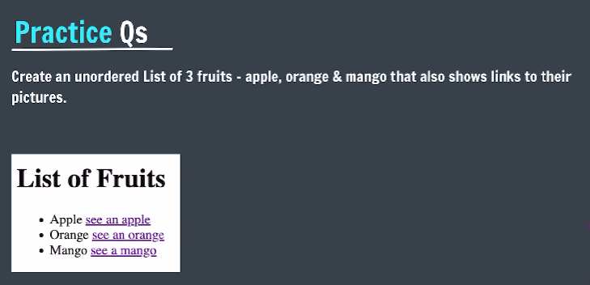
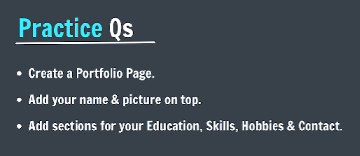

# Practice Questions

- **Qs 1**. <br>
    

- **Qs 2**. <br>
    

- **Qs 3**. Use the correct HTML tag to add a paragraph with the text "Hello World!".

- **Qs 4**.
  - Mark up the text with appropriate tags:
  - "Bla” is the most important heading.
  - "Blabla" is the next most important heading.
  - "Blablabla"is the third most important heading.
  - The last sentence is just a paragraph.
  - Start with the most important heading (the largest) and end with the least important heading (the smallest).

- **Qs 5**. Create a clickable link that redirects to the url: https://www.java.com/en/

- **Qs 6**. You are given the rank list of few students, create an ordered HTML list to display the list given below:
  ```
  1. bla
  2. blabla
  3. blablabla
  ```
  
- **Qs 7**. Read the following topics on MDN:
  - Hr Tag in HTML
  - HTML Entities
