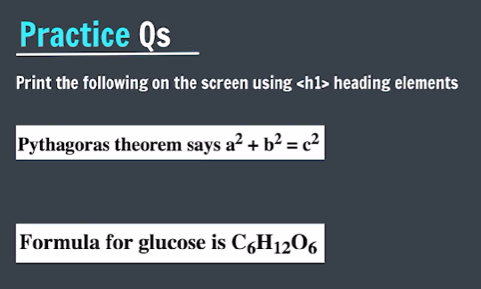
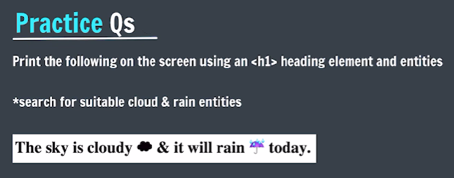
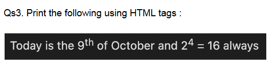

# Practice Questions

- **Qs 1**.  
    
- **Qs 2**.  
    
- **Qs 3**.  
    
- **Qs 4**. Print the symbol for copyright & trademark on your web page.
- **Qs 5**. Add a video element with controls and a poster image.