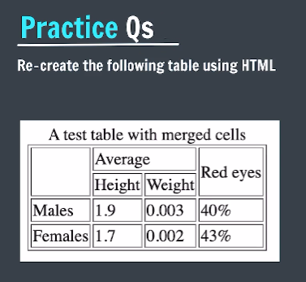
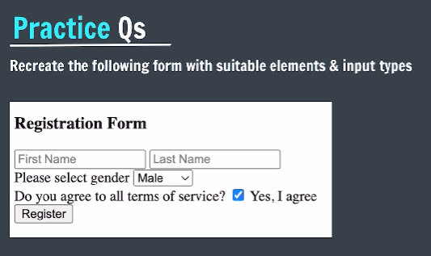
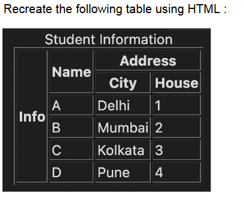
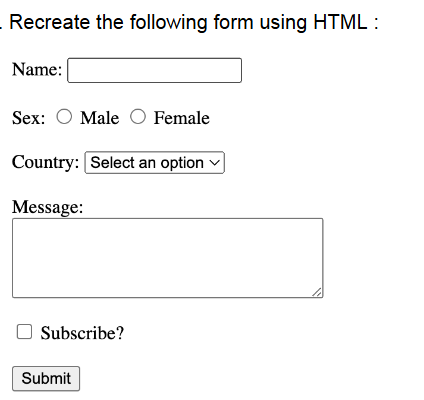
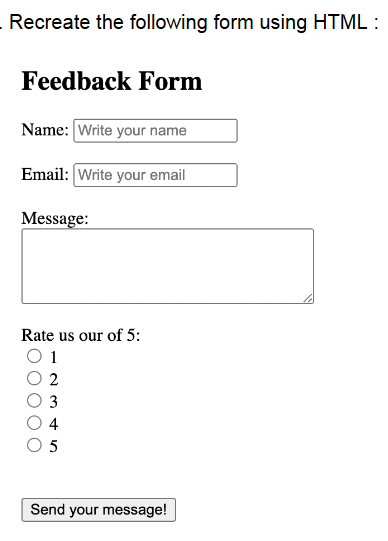

# Practice Questions

- **Qs 1**.  
    
- **Qs 2**. Create a serach option that redirects its search request to google
- **Qs 3**.  
    
- **Qs 4**.  
    
- **Qs 5**.  
    
- **Qs 6**.  
    
