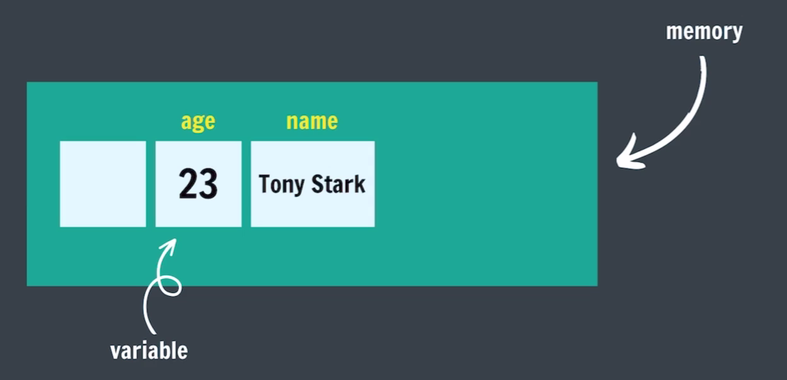
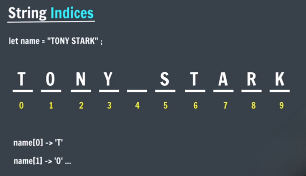

# JavaScript
JavaScript is a programming language used to make websites interactive. It runs in web browsers and allows developers to create dynamic features like buttons, animations, pop-ups, and real-time updates. JavaScript is essential for modern web development and works alongside HTML and CSS to build responsive and engaging websites.

## Using the Console
Uses REPL

REPL: Read-Evaluate-Print Loop

A REPL is an interactive programming environment that takes single user inputs, reads them, evaluates them, prints the result, and then loops back for more input.
Read-Evaluate-Print-Loop

## What is a Variable?
A variable is a named container used to store data in programming.



## Data Types in JS

| Primitive Types |
|-----------------|
| Numbers         |
| Boolean         |
| String          |
| Undefined       |
| Null            |
| BigInt          |
| Symbol          |

- **Numbers in JS**

    - positive (14) & Negative (-4)
    - Integers (45, -50)
    - Floating numbers - with decimal (4.6, -8.9)

- **Boolean in JS** <br>
    Boolean represents a truth value -> true or false / yes or no

    ```js
    let age = 23;
    let isAdult = true;

    let age = 13;
    let isAdult = false;
    ```

- **Strings in Js** <br>
    Strings are text or sequence of characters

    ```js
    let name = "Tony Stark";
    let role = "IronMan";
    let char = 'a';
    let num ='23';
    let empty = "";

    let sentence = 'this is "apple"';
    let sentence = "this is 'apple'";
    ```

    - **String Indices** <br>
        JS is a 0 based indexing programming language

        

    - **Concatenation** <br>
        adding strings together

        ```js
        "tony" + " " + "stark" = "tony stark"

        "tony" + 1 = "tony1"
        ```

- **null & undefined in JS** <br>

    - **undefined**: A variable that has not been assigned a value is of type undefined

        ```js
        let a;
        //undefined

        a
        //undefined
        ```

    - **null**: The null value represents the intentional absence of any object value.

        To be explicitly assigned.

        ```js
        let a = null;
        //undefined

        a
        //undefined
        ```

## JS Operators and Concepts

- **Arithmetic Operators**

    ```js
    a = 20
    b = 10

    //addition
    sum = a + b

    //subtraction
    diff = a - b

    //multiplication
    prod = a * b

    //division
    div = a / b

    //modulo
    rem = a % b
    ```

    - Modulo (reminder operator) `12 % 5 = 2`
    - Exponentiation (power operation) `2**3 = 8`

- **NaN in JS** <br>
    The NaN global property is a value representing **Not-A-Number**.

    ```js
    0/0 // NaN

    NaN - 1 // NaN

    NaN * 1 // NaN

    NaN + NaN // NaN
    ```

- **Operator Precedence** <br>
    Operator Precedence is a set of rules that determines the order in which different operators in an expression are evaluated.

    Operator Precedence for Arithmetic Operators: `( )` `**` `*, /, %` `+, -`

- **Assignment Operators**

    ```js
    age = age + 1;
    age += 1;

    age = age - 1;
    age -= 1;

    age = age * 1;
    age *= 1;
    ```

- **Unary Operators**

    ```js
    age = age + 1;
    age += 1;
    age++ // increment

    age = age - 1;
    age -= 1;
    age-- //decrement
    ```

    - Pre-increment (Change, then use)

        ```js
        let age = 10;
        let newAge = ++age;
        ```

    - Post-increment (use, then change)

        ```js
        let age = 10;
        let newAge = age++;
        ```

    - Pre-decrement (Change, then use)

        ```js
        let age = 10;
        let newAge = --age;
        ```

    - Post-decrement (use, then change)

        ```js
        let age = 10;
        let newAge = age--;
        ```
    
## let, const, and var Keywords 

- **let keyword** <br>
    Syntax of declaring variables.

    ```js
    let age = 23;
    age = age + 1;

    let cgpa;
    cgpa = 8.9

    let num1 = 1;
    let num2 = 2;
    let sum = num1 + num2;
    ```

- **const Keyword** <br>
    Values of constants can't be chnaged with re-assignment & they can't be re-declared.

    ```js
    const year = 2025;
    year = 2026; //Error
    year = year + 1; //Error

    const pi = 3.14;
    const g = 9.8;
    ```

- **var Keyword** <br>
    Old Syntax of writing variables

    ```js
    var age = 23;
    var cgpa = 8.9;

    var num1 = 1;
    var num2 = 2;
    var sum = num1 + num2;
    ```

## Identifier Rules
All JavaScript variables must be identified with unique names (identifiers).

- Names can contain letters, digits, underscores, and dollar signs. (no space)
- Names must begin with a letter.
- Names can also begin with $ and _.
- Names are case sensitive (y and Y are different variables).
- reserved words (like javaScript keywords) CANNOT be used as names.

- **camelCase**

    Way of Writing identifiers

    camelCase (JS naming convention)

    snake_case

    Pascalcase

## What is TypeScript

Static Typed, where JS is dynamic typed

Designed by Microsoft
