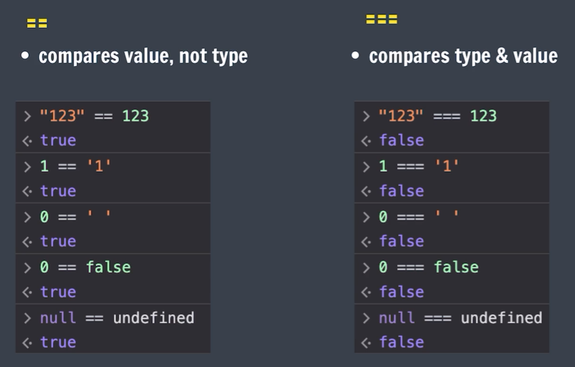
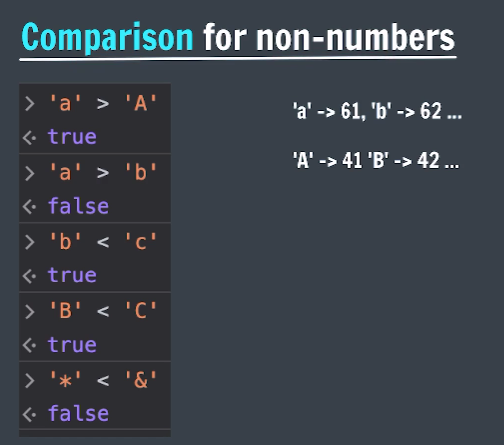

## console.log()
To write (log) a message on the console

```js
console.log("Hello World");

console.log(12345);

console.log(2+2);

console.log("Hello", "World", 123);
```

## Linking JS File

```html
<script src="app.js"></script>
```

## Template Literals
They are used to add embedded expressions in a string.

```js
let a = 5;
let b = 10;
console.log(`Your pay ${a + b} rupees`);

// console.log("Price is", a + b, "rupees");
```

## Operators in JS

- Arithmetic (+, -, *, /, %, **)
- Unary (++, --)
- Assignment (=, +=, -=, *=, /=, %=, etc)
- Comparison
- Logical

- **Comparison Operator** <br>
    Comparison Operators used to compare 2 values

    `>, >=, <, <=, ==, !=`

    - `==`, `!=` compares value, not type
    - `===`, `!==` compares value & type

        <br>
    - Comparison for non numbers<br>
        

- **Logical Operators** <br>
    Logical operators are used to combine boolean expressions.

    - && Logical AND
    - || Logical OR
    - ! Logical NOT

    ```js
    true && true // true
    true && false // false
    false && true // false
    false && false // false

    true || true // true
    true || false // true
    false || true // true
    false || false // false

    !true // false
    !false // true
    ```

## truthy and falsy
Everything in JS is true or false (in boolean context).

This doest'nt mean their value itself is false or true, but they are treated as false or true if taken in boolean context.

- **Falsy values** <br>
false, 0 , -0, 0n (bigint value), ""(empty string), null, undefined, NaN

- **Truthy values** <br>
Everything else

## Conditional Statements

- if-else
- nested if-else
- switch

- **if Statement**

    ```js
    // some code before if

    if (some condition) {
        // Do SOMETHING
    }

    // some code after if
    ```

- **else if Statement**

    ```js
    if (condition1) {
        // Do SOMETHING
    }
    else if (condition2) {
        // Do SOMETHING ELSE
    }
    else if (condition3) {
        // Do SOMETHING ELSE
    }
    ```

- **else Statement**

    ```js
    if (condition1) {
        // Do SOMETHING
    }
    else {
        // Do SOMETHING ELSE
    }

    ```

- **Nested if-else** <br>
    Nesting is writing if-else inside if-else statements. It can have many levels

    ```js
    if (condition1) {
        if (condition2) {
            // Do SOMETHING
        }
        else {
            // Do SOMETHING ELSE
        }
    }
    else {
        // Do SOMETHING ELSE
    }
    ```

- **Switch Statement** <br>
    Used when we have some fixed values that we need to compare to.

    ```js
    let color = "yellow";

    switch (color) {
        case "red" :
            console.log ("Stop");
            break;
        case "yellow" :
            console.log ("Slow Down");
            break;
        case "green" :
            console.log ("Go");
            break;
        default :
            console.log ("Briken Light");
    }
    ```

## Alerts & Prompts

- Alerts displays an alert message on the page.

    ```js
    alert("something wrong");
    ```

- prompt displays a dialog box that asks user for some input.

    ```js
    prompt("please enter your roll no.")
    ```
