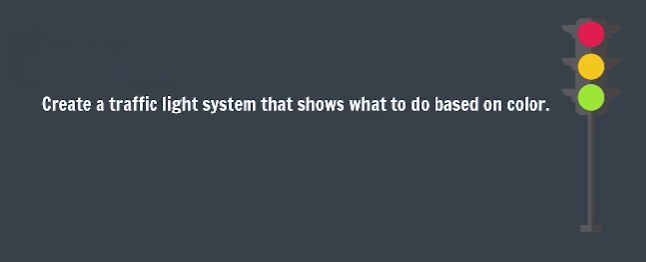
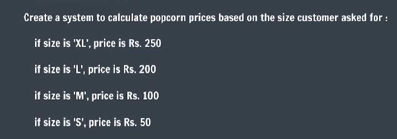

# Practice Questions

- **Qs 1.** <br> 
- **Qs 2.** <br> 
- **Qs 3.** A **good string** is a string that starts with the letter `a` & has a `length > 3`.

    Write a Program to find if a string is good or not.

- **Qs 4.** Use switch statement to print the day of the week using a number variable 'day' with values 1 to 7.

    1 = Monday, 2 = Tuesday & so on

- **Qs 5.** Predict the output of following code:

    ```js
    let num = 12;
    if((num%3 == 0) && ((num+1 == 15)  || (num-1 == 11))) {
        console.log("safe");
    }
    else {
        console.log("unsafe");
    }
    ```
    
    **Ans:** `safe`

- **Qs 6.** Create a number variable num with some value.
    
    Now, print “good”if the number is divisible by 10 and print “bad” if it is not.

- **Qs 7.** Take the user's name & age as input using prompts.

    Then return back the following statement to the user as an alert (by substituting their name & age):

    **name** is **age** years old.

    [Use template Literals to print this sentence]

- **Qs 8.** Write a switch statement to print the months in a quarter.

    Months in Quarter 1: January, February, March

    Months in Quarter 2: April, May, June

    Months in Quarter 3: July, August, September

    Months in Quarter 4: October, November, December

    [Use the number as the case value in switch]

- **Qs 9.** A string is a **golden string** if it starts with the character ‘A’ or ‘a’ and has a total length greater than 5.

    For a given string print if it is golden or not.

- **Qs 10.** Write a program to find the largest of 3 numbers.

- **Qs 11 (Bonus).** Write a program to check if 2 numbers have the same last digit.

    Eg: 32 and 47852 have the same last digit i.e. 2